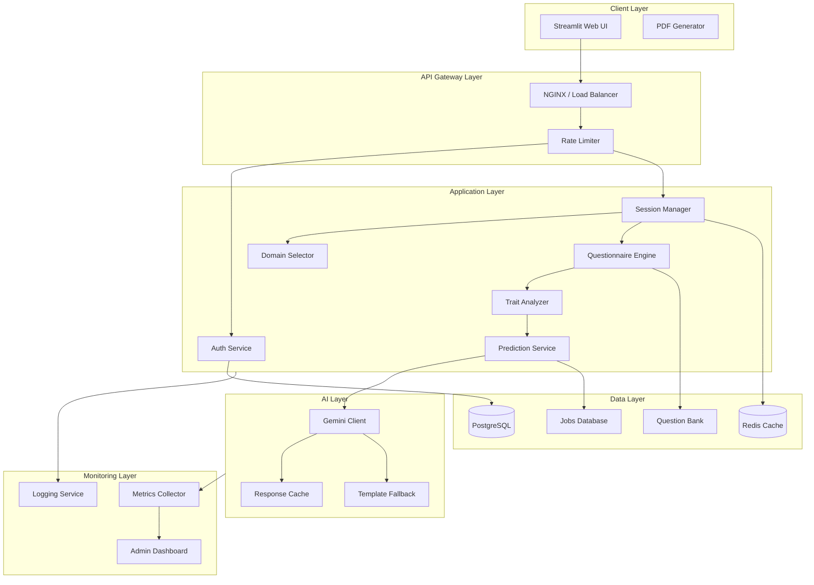
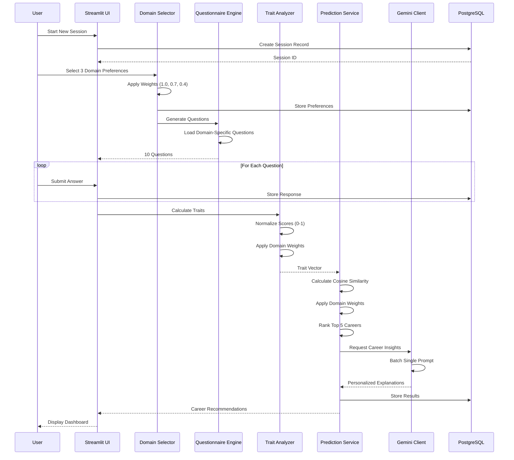
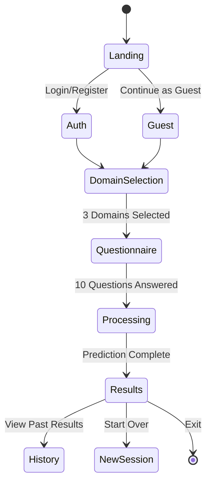
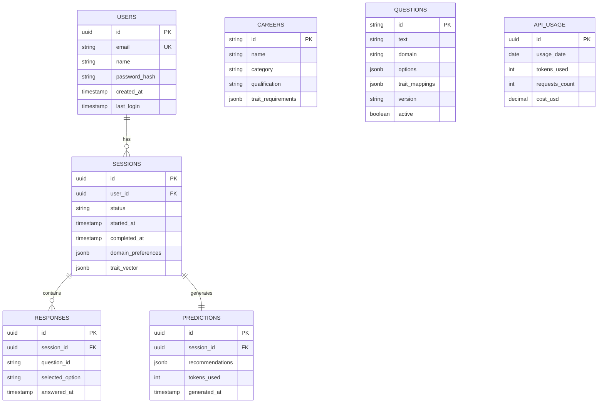
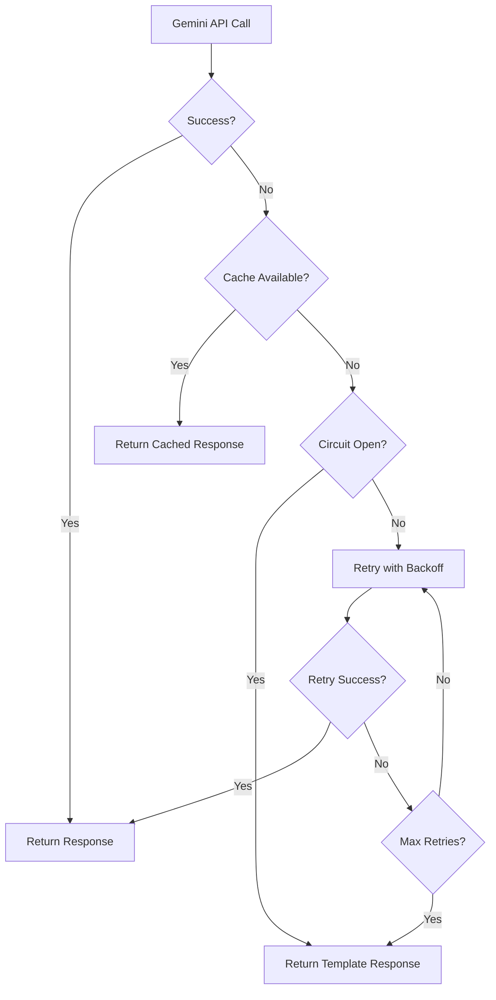
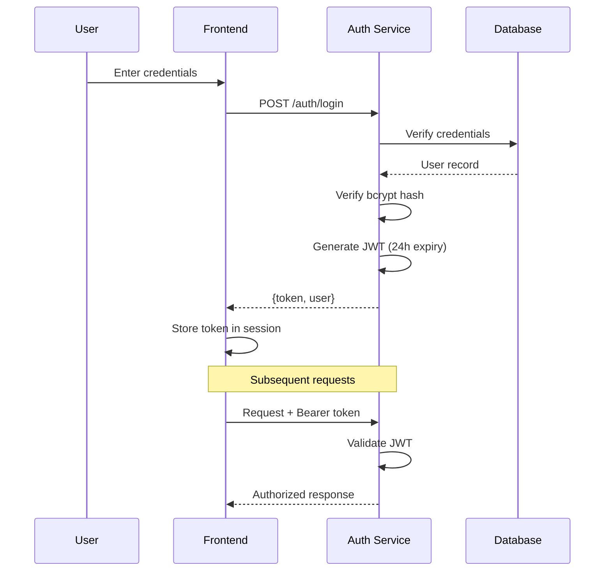

# Design Document: Career Prediction Engine

## Overview

The Career Prediction Engine is a production-ready, modular AI-powered career recommendation system built with Python/Streamlit frontend and a layered backend architecture. The system employs a weighted preference algorithm combined with Google Gemini 2.0 Flash for intelligent career insights, designed to handle 500-2000 daily users while maintaining low operational costs ($50-200/month).

### Key Design Principles

1. **Modularity**: Each component is independently deployable and testable
2. **Cost Efficiency**: Optimized LLM usage with batching, caching, and fallbacks
3. **Scalability**: Stateless services with horizontal scaling capability
4. **Resilience**: Circuit breakers, retries, and graceful degradation
5. **Maintainability**: Configuration-driven question bank and career database

---

## Architecture

### High-Level System Architecture



### Data Flow Architecture



---

## Components and Interfaces

### 1. Streamlit Web UI Component

**Purpose**: User-facing interface for the entire prediction workflow

**Technology**: Streamlit 1.31+, Plotly for charts, ReportLab for PDF

```python
# Interface Definition
class StreamlitUI:
    def render_landing_page() -> None
    def render_auth_modal() -> Optional[User]
    def render_domain_selector() -> DomainPreferences
    def render_questionnaire(questions: List[Question]) -> List[Response]
    def render_results_dashboard(prediction: CareerPrediction) -> None
    def generate_pdf_report(prediction: CareerPrediction) -> bytes
```

**UI Flow States**:


### 2. Authentication Service

**Purpose**: User registration, login, and session management

**Technology**: Python, bcrypt, JWT tokens

```python
# Interface Definition
class AuthService:
    def register(email: str, name: str, password: str) -> User
    def login(email: str, password: str) -> AuthToken
    def validate_token(token: str) -> Optional[User]
    def logout(token: str) -> bool
    def get_user_history(user_id: str) -> List[SessionSummary]

# Data Models
@dataclass
class User:
    id: str
    email: str
    name: str
    created_at: datetime
    
@dataclass
class AuthToken:
    access_token: str
    expires_at: datetime
    user_id: str
```

### 3. Domain Selector Component

**Purpose**: Capture and weight user's domain preferences

**Technology**: Python, Pydantic for validation

```python
# Interface Definition
class DomainSelector:
    AVAILABLE_DOMAINS = ["Tech", "Design", "Manufacturing", "Marketing", "Data", "Sales"]
    WEIGHTS = {1: 1.0, 2: 0.7, 3: 0.4}
    
    def get_available_domains() -> List[DomainInfo]
    def validate_selection(selections: List[str]) -> ValidationResult
    def create_preferences(selections: List[str]) -> DomainPreferences

# Data Models
@dataclass
class DomainInfo:
    name: str
    description: str
    job_count: int
    icon: str

@dataclass
class DomainPreferences:
    first_choice: str      # weight: 1.0
    second_choice: str     # weight: 0.7
    third_choice: str      # weight: 0.4
    
    def get_weight(self, domain: str) -> float
```

### 4. Questionnaire Engine Component

**Purpose**: Generate and manage domain-specific questions

**Technology**: Python, JSON question bank

```python
# Interface Definition
class QuestionnaireEngine:
    def load_question_bank() -> QuestionBank
    def generate_questions(preferences: DomainPreferences) -> List[Question]
    def validate_response(question_id: str, answer: str) -> bool
    def get_trait_mappings(responses: List[Response]) -> Dict[str, float]

# Data Models
@dataclass
class Question:
    id: str
    text: str
    domain: Optional[str]  # None for general questions
    options: List[QuestionOption]
    trait_mappings: Dict[str, float]
    version: str

@dataclass
class QuestionOption:
    id: str
    text: str
    trait_scores: Dict[str, float]

@dataclass
class Response:
    question_id: str
    selected_option_id: str
    timestamp: datetime
```

**Question Allocation Logic**:
```
Total: 10 questions
├── 1st Preference Domain: 3 questions (weight 1.0)
├── 2nd Preference Domain: 2 questions (weight 0.7)
├── 3rd Preference Domain: 1 question (weight 0.4)
└── General Trait Assessment: 4 questions (weight 1.0)
```

### 5. Trait Analyzer Component

**Purpose**: Calculate normalized trait vectors from responses

**Technology**: Python, NumPy for vector operations

```python
# Interface Definition
class TraitAnalyzer:
    TRAIT_DIMENSIONS = [
        "Extroversion", "Analytical", "Government_Exam_Prep",
        "Creative_Roles", "Travel_Willingness", "Tech_Learning",
        "Physical_Activity", "Writing", "Planning", "Marketing"
    ]
    
    def calculate_trait_vector(
        responses: List[Response],
        preferences: DomainPreferences
    ) -> TraitVector
    
    def normalize_scores(raw_scores: Dict[str, float]) -> Dict[str, float]
    def apply_domain_weights(scores: Dict[str, float], preferences: DomainPreferences) -> Dict[str, float]

# Data Models
@dataclass
class TraitVector:
    extroversion: float        # 0.0 - 1.0
    analytical: float          # 0.0 - 1.0
    govt_exam_prep: float      # 0.0 - 1.0
    creative_roles: float      # 0.0 - 1.0
    travel_willingness: float  # 0.0 - 1.0
    tech_learning: float       # 0.0 - 1.0
    physical_activity: float   # 0.0 - 1.0
    writing: float             # 0.0 - 1.0
    planning: float            # 0.0 - 1.0
    marketing: float           # 0.0 - 1.0
    
    def to_numpy_array(self) -> np.ndarray
    def cosine_similarity(self, other: 'TraitVector') -> float
```

### 6. Prediction Service Component

**Purpose**: Calculate career matches and generate recommendations

**Technology**: Python, NumPy, scikit-learn

```python
# Interface Definition
class PredictionService:
    def load_career_database() -> List[Career]
    def calculate_match_scores(
        trait_vector: TraitVector,
        preferences: DomainPreferences
    ) -> List[CareerMatch]
    
    def get_top_recommendations(
        matches: List[CareerMatch],
        count: int = 5
    ) -> List[CareerRecommendation]
    
    def enhance_with_insights(
        recommendations: List[CareerRecommendation],
        trait_vector: TraitVector,
        preferences: DomainPreferences
    ) -> List[CareerRecommendation]

# Data Models
@dataclass
class Career:
    id: str
    name: str
    category: str
    qualification: str
    trait_requirements: TraitVector

@dataclass
class CareerMatch:
    career: Career
    base_score: float           # Cosine similarity (0-1)
    domain_weight: float        # From preferences (0.4-1.0)
    final_score: float          # base_score * domain_weight
    match_percentage: int       # 0-100

@dataclass
class CareerRecommendation:
    career: Career
    match_percentage: int
    explanation: str            # LLM-generated
    skills_to_develop: List[str]
    growth_paths: List[str]
    salary_range: str
```

### 7. Gemini Client Component

**Purpose**: Interface with Google Gemini 2.0 Flash API

**Technology**: Python, google-generativeai SDK

```python
# Interface Definition
class GeminiClient:
    MODEL = "gemini-2.0-flash"
    MAX_DAILY_TOKENS = 1_000_000
    
    def __init__(self, api_key: str)
    def generate_career_insights(
        careers: List[Career],
        trait_vector: TraitVector,
        preferences: DomainPreferences
    ) -> List[CareerInsight]
    
    def count_tokens(prompt: str) -> int
    def check_daily_limit() -> TokenBudget
    def get_fallback_response(career: Career) -> CareerInsight

# Data Models
@dataclass
class CareerInsight:
    career_id: str
    explanation: str
    skills_to_develop: List[str]
    growth_paths: List[str]
    salary_range: str
    source: str  # "gemini" or "fallback"

@dataclass
class TokenBudget:
    used_today: int
    remaining: int
    limit: int
    reset_time: datetime
```

**Prompt Template**:
```
You are a career counselor. Based on the candidate's profile, provide insights for their top 5 career matches.

Candidate Profile:
- Domain Preferences: {preferences}
- Trait Scores: {trait_vector}

For each career below, provide:
1. Why this career matches their profile (2-3 sentences)
2. Top 3 skills they should develop
3. 2 potential growth paths
4. Expected salary range (entry to senior level)

Careers to analyze:
{career_list}

Respond in JSON format with array of career insights.
```

### 8. Response Store Component

**Purpose**: Persist user sessions and enable analytics

**Technology**: PostgreSQL, SQLAlchemy ORM

```python
# Interface Definition
class ResponseStore:
    def create_session(user_id: Optional[str]) -> Session
    def store_preferences(session_id: str, preferences: DomainPreferences) -> None
    def store_response(session_id: str, response: Response) -> None
    def store_results(session_id: str, prediction: CareerPrediction) -> None
    def complete_session(session_id: str) -> None
    def get_session(session_id: str) -> Session
    def query_sessions(filters: SessionFilters) -> List[SessionSummary]
    def get_analytics(date_range: DateRange) -> AnalyticsData
```

---

## Data Models

### Database Schema



### Career Database Structure (from Excel)

```python
# Loaded from Jobs - Career Prediction.xlsx
CAREER_DATABASE = {
    "Tech": [
        {"name": "AI Engineer", "qualification": "Engineering", 
         "traits": {"analytical": 1.0, "tech_learning": 1.0}},
        {"name": "Cyber Security Engineer", "qualification": "Engineering",
         "traits": {"analytical": 1.0, "tech_learning": 1.0}},
        # ... 11 total Tech jobs
    ],
    "Design": [
        {"name": "UI-UX Designer", "qualification": "Bachelors",
         "traits": {"extroversion": 1.0, "creative_roles": 1.0, "tech_learning": 1.0, "planning": 1.0}},
        # ... 5 total Design jobs
    ],
    "Manufacturing": [
        {"name": "Industrial Designer", "qualification": "Bachelors",
         "traits": {"analytical": 1.0, "creative_roles": 1.0}},
        # ... 10 total Manufacturing jobs
    ],
    "Marketing": [
        # ... 12 total Marketing jobs
    ],
    "Data": [
        # ... 5 total Data jobs
    ],
    "Sales": [
        # ... 1 total Sales job
    ]
}
# Total: 44 careers across 6 domains
```

---

## Tech Stack Summary

| Layer | Technology | Purpose | Cost |
|-------|------------|---------|------|
| **Frontend** | Streamlit 1.31+ | Web UI | Free (OSS) |
| **Charts** | Plotly | Interactive visualizations | Free (OSS) |
| **PDF** | ReportLab | Report generation | Free (OSS) |
| **Backend** | Python 3.11+ | Core application | Free |
| **API Framework** | FastAPI (optional) | REST endpoints | Free (OSS) |
| **Database** | PostgreSQL 15+ | Data persistence | ~$15/mo (managed) |
| **Cache** | Redis | Session cache, rate limiting | ~$10/mo (managed) |
| **AI Model** | Gemini 2.0 Flash | Career insights | ~$50-75/mo |
| **Auth** | bcrypt + JWT | Security | Free (OSS) |
| **Deployment** | Docker + Cloud Run | Containerization | ~$20-40/mo |
| **Monitoring** | Prometheus + Grafana | Observability | Free (OSS) |

---

## Detailed Cost Analysis

### Gemini 2.0 Flash Pricing (as of 2025)

| Metric | Price |
|--------|-------|
| Input tokens | $0.075 per 1M tokens |
| Output tokens | $0.30 per 1M tokens |
| Context window | 1M tokens |
| Rate limit | 1500 RPM (requests per minute) |

### Token Usage Estimation Per Session

```
Single User Session Breakdown:
├── Career Insights Prompt
│   ├── System prompt: ~200 tokens
│   ├── User profile (traits + preferences): ~150 tokens
│   ├── 5 careers context: ~250 tokens
│   └── Total Input: ~600 tokens
│
├── Career Insights Response
│   ├── 5 careers × 200 words each: ~1,500 tokens
│   └── Total Output: ~1,500 tokens
│
└── Total per session: ~2,100 tokens
```

### Monthly Cost Projections

#### Scenario 1: Low Usage (500 users/day)
```
Daily:
- Sessions: 500
- Input tokens: 500 × 600 = 300,000 tokens
- Output tokens: 500 × 1,500 = 750,000 tokens
- Daily cost: (0.3M × $0.075/1M) + (0.75M × $0.30/1M) = $0.02 + $0.23 = $0.25

Monthly (30 days):
- Total cost: $0.25 × 30 = $7.50/month
```

#### Scenario 2: Medium Usage (1,500 users/day) - YOUR TARGET
```
Daily:
- Sessions: 1,500
- Input tokens: 1,500 × 600 = 900,000 tokens
- Output tokens: 1,500 × 1,500 = 2,250,000 tokens
- Daily cost: (0.9M × $0.075/1M) + (2.25M × $0.30/1M) = $0.07 + $0.68 = $0.75

Monthly (30 days):
- Total cost: $0.75 × 30 = $22.50/month
```

#### Scenario 3: High Usage (2,000 users/day)
```
Daily:
- Sessions: 2,000
- Input tokens: 2,000 × 600 = 1,200,000 tokens
- Output tokens: 2,000 × 1,500 = 3,000,000 tokens
- Daily cost: (1.2M × $0.075/1M) + (3M × $0.30/1M) = $0.09 + $0.90 = $0.99

Monthly (30 days):
- Total cost: $0.99 × 30 = $29.70/month
```

### Complete Infrastructure Cost Breakdown

| Component | Low (500/day) | Medium (1500/day) | High (2000/day) |
|-----------|---------------|-------------------|-----------------|
| **Gemini API** | $7.50 | $22.50 | $29.70 |
| **PostgreSQL (managed)** | $15 | $15 | $25 |
| **Redis (managed)** | $10 | $10 | $15 |
| **Cloud Run / Compute** | $20 | $35 | $50 |
| **Storage (50GB)** | $5 | $5 | $10 |
| **Bandwidth** | $5 | $10 | $15 |
| **Domain + SSL** | $2 | $2 | $2 |
| **Monitoring** | $0 | $0 | $10 |
| **TOTAL MONTHLY** | **$64.50** | **$99.50** | **$156.70** |

### Cost Optimization Strategies Implemented

1. **Prompt Batching**: Single API call for all 5 career insights (vs 5 separate calls)
   - Saves: ~40% on API costs

2. **Response Caching**: Cache common career explanations for 24 hours
   - Saves: ~20-30% on repeat queries

3. **Template Fallbacks**: Pre-written templates when API limit reached
   - Ensures: Zero overage charges

4. **Token Budgeting**: Daily limit of 1M tokens (~$0.30/day max)
   - Guarantees: Max $9/month on API even with abuse

---

## Question Bank Design

### Question Categories and Distribution

```
10 Questions Total:
├── Domain-Specific Questions (6 total)
│   ├── 1st Preference: 3 questions
│   ├── 2nd Preference: 2 questions
│   └── 3rd Preference: 1 question
│
└── General Trait Assessment (4 questions)
    ├── Work style preferences
    ├── Achievement orientation
    ├── Learning preferences
    └── Career values
```

### Sample Question Structure

```json
{
  "id": "tech_q1",
  "domain": "Tech",
  "text": "When solving a complex problem, which approach resonates most with you?",
  "options": [
    {
      "id": "a",
      "text": "Break it down systematically and analyze each component",
      "trait_scores": {"analytical": 0.9, "planning": 0.7}
    },
    {
      "id": "b",
      "text": "Brainstorm creative solutions and experiment quickly",
      "trait_scores": {"creative_roles": 0.8, "tech_learning": 0.6}
    },
    {
      "id": "c",
      "text": "Collaborate with others to gather diverse perspectives",
      "trait_scores": {"extroversion": 0.9, "marketing": 0.4}
    },
    {
      "id": "d",
      "text": "Research existing solutions and adapt them",
      "trait_scores": {"analytical": 0.6, "tech_learning": 0.8}
    }
  ],
  "version": "1.0"
}
```

### Question Types by Domain

**Tech Domain Questions** (Focus: Analytical, Tech Learning)
- Problem-solving approaches
- Learning new technologies
- Code vs. design preferences
- Team vs. solo work

**Design Domain Questions** (Focus: Creative, Extroversion)
- Visual vs. functional priorities
- User feedback handling
- Iteration preferences
- Aesthetic sensibilities

**Manufacturing Domain Questions** (Focus: Physical Activity, Planning)
- Hands-on vs. supervisory roles
- Quality vs. speed tradeoffs
- Process improvement attitudes
- Safety consciousness

**Marketing Domain Questions** (Focus: Extroversion, Writing, Marketing)
- Communication style preferences
- Data vs. intuition in decisions
- Campaign creativity
- Audience understanding

**Data Domain Questions** (Focus: Analytical, Writing)
- Data interpretation approaches
- Visualization preferences
- Statistical reasoning
- Storytelling with data

**Sales Domain Questions** (Focus: Extroversion, Travel)
- Relationship building style
- Rejection handling
- Goal orientation
- Negotiation approach

**General Trait Questions** (4 questions covering):
1. Work environment preferences (remote/office/hybrid)
2. Achievement types that motivate you
3. Learning style (formal/self-taught/mentorship)
4. Long-term career values (stability/growth/impact)

---

## Error Handling Strategy

### Circuit Breaker Configuration

```python
CIRCUIT_BREAKER_CONFIG = {
    "gemini_api": {
        "failure_threshold": 5,
        "recovery_timeout": 60,  # seconds
        "half_open_requests": 3
    },
    "database": {
        "failure_threshold": 3,
        "recovery_timeout": 30,
        "half_open_requests": 2
    }
}
```

### Fallback Hierarchy



### Error Response Templates

```python
FALLBACK_TEMPLATES = {
    "AI Engineer": {
        "explanation": "Based on your analytical mindset and interest in technology, AI Engineering aligns well with your profile. This role combines problem-solving with cutting-edge technology.",
        "skills_to_develop": ["Machine Learning", "Python", "Data Structures"],
        "growth_paths": ["Senior AI Engineer", "ML Architect"],
        "salary_range": "$80,000 - $180,000"
    },
    # ... templates for all 44 careers
}
```

---

## Security Considerations

### Authentication Flow



### Security Measures

1. **Password Security**
   - bcrypt with 12 rounds
   - Minimum 8 characters, complexity requirements
   - Rate limiting on login attempts (5/minute)

2. **Data Protection**
   - All data encrypted at rest (AES-256)
   - TLS 1.3 for data in transit
   - PII anonymization in analytics

3. **API Security**
   - JWT tokens with 24-hour expiry
   - CORS restricted to known domains
   - Input validation on all endpoints

4. **Rate Limiting**
   - 10 requests/minute per IP
   - 50 sessions/day per user
   - 1M tokens/day for Gemini API

---

## Deployment Architecture

### Container Structure

```dockerfile
# Dockerfile
FROM python:3.11-slim

WORKDIR /app
COPY requirements.txt .
RUN pip install --no-cache-dir -r requirements.txt

COPY . .
EXPOSE 8501

CMD ["streamlit", "run", "app.py", "--server.port=8501", "--server.address=0.0.0.0"]
```

### Cloud Deployment Options

#### Option 1: Google Cloud Run (Recommended for Gemini)
```yaml
# cloud-run-config.yaml
apiVersion: serving.knative.dev/v1
kind: Service
metadata:
  name: career-prediction-engine
spec:
  template:
    spec:
      containers:
        - image: gcr.io/project/career-prediction:latest
          resources:
            limits:
              memory: 1Gi
              cpu: "1"
          env:
            - name: GEMINI_API_KEY
              valueFrom:
                secretKeyRef:
                  name: gemini-secret
                  key: api-key
```

#### Option 2: AWS (ECS + Fargate)
```yaml
# task-definition.json
{
  "family": "career-prediction",
  "cpu": "512",
  "memory": "1024",
  "containerDefinitions": [{
    "name": "app",
    "image": "ecr/career-prediction:latest",
    "portMappings": [{"containerPort": 8501}]
  }]
}
```

#### Option 3: Self-Hosted (Docker Compose)
```yaml
# docker-compose.yml
version: '3.8'
services:
  app:
    build: .
    ports:
      - "8501:8501"
    environment:
      - DATABASE_URL=postgresql://user:pass@db:5432/careers
      - REDIS_URL=redis://cache:6379
      - GEMINI_API_KEY=${GEMINI_API_KEY}
    depends_on:
      - db
      - cache
  
  db:
    image: postgres:15
    volumes:
      - pgdata:/var/lib/postgresql/data
    environment:
      - POSTGRES_DB=careers
      - POSTGRES_USER=user
      - POSTGRES_PASSWORD=pass
  
  cache:
    image: redis:7-alpine
    
volumes:
  pgdata:
```

---

## Correctness Properties

*A property is a characteristic or behavior that should hold true across all valid executions of a system—essentially, a formal statement about what the system should do. Properties serve as the bridge between human-readable specifications and machine-verifiable correctness guarantees.*

### Property 1: Domain Weight Assignment Consistency

*For any* domain selection where a domain is chosen as 1st, 2nd, or 3rd preference, the assigned weight SHALL be exactly 1.0, 0.7, or 0.4 respectively, and this mapping SHALL be deterministic and consistent across all sessions.

**Validates: Requirements 1.2, 1.3, 1.4**

### Property 2: Domain Selection Uniqueness

*For any* sequence of domain selections within a single session, no domain SHALL appear more than once in the final preferences, and any attempt to select a duplicate SHALL be rejected.

**Validates: Requirements 1.5**

### Property 3: Question Generation Completeness

*For any* valid DomainPreferences input, the Questionnaire_Engine SHALL generate exactly 10 questions with the distribution: 3 questions tagged to 1st preference domain, 2 to 2nd preference, 1 to 3rd preference, and 4 general questions.

**Validates: Requirements 2.1, 2.2**

### Property 4: Question Option Count Validity

*For any* generated question, the number of options SHALL be between 4 and 5 inclusive.

**Validates: Requirements 2.4**

### Property 5: Trait Score Normalization

*For any* calculated trait score in a TraitVector, the value SHALL be in the range [0.0, 1.0] inclusive.

**Validates: Requirements 3.2**

### Property 6: Trait Vector Completeness

*For any* complete set of questionnaire responses, the resulting TraitVector SHALL contain non-null scores for all 9 trait dimensions, with undetermined traits defaulting to 0.5.

**Validates: Requirements 3.1, 3.5**

### Property 7: Career Score Calculation Coverage

*For any* valid TraitVector and DomainPreferences, the Prediction_Service SHALL calculate match scores for all 44 careers in the database.

**Validates: Requirements 4.1**

### Property 8: Cosine Similarity Bounds

*For any* career match calculation using cosine similarity, the resulting base_score SHALL be in the range [-1.0, 1.0], and after normalization to percentage, SHALL be in [0, 100].

**Validates: Requirements 4.2, 4.6**

### Property 9: Domain Weight Application

*For any* career in a user's preferred domains, the final_score SHALL equal base_score multiplied by the corresponding domain_weight (1.0, 0.7, or 0.4). For careers outside preferred domains, domain_weight SHALL be 0.0.

**Validates: Requirements 4.3**

### Property 10: Recommendation Ranking Order

*For any* set of career recommendations, the careers SHALL be sorted in strictly descending order by final_score.

**Validates: Requirements 4.4**

### Property 11: Top 5 Recommendation Constraint

*For any* prediction result, exactly 5 career recommendations SHALL be returned, each with a match_percentage in [0, 100].

**Validates: Requirements 4.5, 4.6**

### Property 12: LLM Explanation Format Validation

*For any* LLM-generated career explanation, the response SHALL contain all required components (why_matches, skills_to_develop, growth_paths, salary_range) and the explanation text SHALL be between 150-200 words.

**Validates: Requirements 5.3, 5.4**

### Property 13: API Request Batching

*For any* career insight generation request for N careers, exactly 1 API call SHALL be made (not N separate calls).

**Validates: Requirements 5.6**

### Property 14: Session ID Uniqueness

*For any* two sessions created, their session_ids SHALL be unique and non-colliding.

**Validates: Requirements 6.1**

### Property 15: Session Data Persistence Round-Trip

*For any* completed session, storing then retrieving the session SHALL return equivalent data for: session_id, domain_preferences, responses, trait_vector, and recommendations.

**Validates: Requirements 6.2, 6.3**

### Property 16: Password Hashing Security

*For any* user registration, the stored password_hash SHALL be a valid bcrypt hash with cost factor >= 12, and the original password SHALL NOT be recoverable from the hash.

**Validates: Requirements 7.3**

### Property 17: Rate Limiting Enforcement

*For any* IP address exceeding 10 requests per minute OR any user exceeding 50 sessions per day, subsequent requests SHALL receive HTTP 429 response with retry-after header.

**Validates: Requirements 9.4, 9.5, 9.6**

### Property 18: Daily Token Budget Enforcement

*For any* day, the total tokens consumed by Gemini API calls SHALL NOT exceed 1,000,000, and when limit is reached, template fallbacks SHALL be used.

**Validates: Requirements 9.2, 9.3**

### Property 19: Circuit Breaker Activation

*For any* external service (Gemini API, Database), after 5 consecutive failures, the circuit breaker SHALL open and subsequent calls SHALL use fallback mechanisms until recovery timeout.

**Validates: Requirements 10.4**

### Property 20: Error Message Sanitization

*For any* error displayed to end users, the message SHALL NOT contain stack traces, internal paths, or technical implementation details.

**Validates: Requirements 10.5**

---

## Testing Strategy

### Dual Testing Approach

The Career Prediction Engine employs both unit testing and property-based testing for comprehensive coverage:

1. **Unit Tests**: Verify specific examples, edge cases, and integration points
2. **Property-Based Tests**: Verify universal properties across randomized inputs

### Property-Based Testing Framework

**Framework**: Hypothesis (Python)

**Configuration**:
```python
from hypothesis import settings, Verbosity

# Global settings for all property tests
settings.register_profile("ci", max_examples=100, verbosity=Verbosity.verbose)
settings.register_profile("dev", max_examples=50)
settings.load_profile("ci")
```

### Test Categories

#### Unit Tests
- Domain selector validation edge cases
- Question bank loading and parsing
- Trait calculation with known inputs
- API response parsing
- Error handling scenarios

#### Property-Based Tests
- Domain weight assignment (Property 1)
- Question generation distribution (Property 3)
- Trait normalization bounds (Property 5)
- Cosine similarity bounds (Property 8)
- Ranking order verification (Property 10)
- Session ID uniqueness (Property 14)
- Rate limiting behavior (Property 17)

### Test File Structure

```
tests/
├── unit/
│   ├── test_domain_selector.py
│   ├── test_questionnaire_engine.py
│   ├── test_trait_analyzer.py
│   ├── test_prediction_service.py
│   ├── test_gemini_client.py
│   └── test_response_store.py
├── property/
│   ├── test_domain_weights_property.py
│   ├── test_question_generation_property.py
│   ├── test_trait_normalization_property.py
│   ├── test_career_scoring_property.py
│   ├── test_session_persistence_property.py
│   └── test_rate_limiting_property.py
└── integration/
    ├── test_full_session_flow.py
    └── test_api_fallbacks.py
```

### Property Test Annotation Format

Each property test must include:
```python
# Feature: career-prediction-engine, Property 5: Trait Score Normalization
# Validates: Requirements 3.2
@given(responses=st.lists(response_strategy(), min_size=10, max_size=10))
def test_trait_scores_normalized(responses):
    """For any calculated trait score, value SHALL be in [0.0, 1.0]"""
    trait_vector = trait_analyzer.calculate_trait_vector(responses, sample_preferences)
    for trait_name, score in trait_vector.to_dict().items():
        assert 0.0 <= score <= 1.0, f"Trait {trait_name} out of bounds: {score}"
```

---

## Monitoring and Observability

### Metrics to Collect

```python
METRICS = {
    # Business Metrics
    "sessions_started": Counter,
    "sessions_completed": Counter,
    "careers_recommended": Histogram,
    
    # Performance Metrics
    "prediction_latency_seconds": Histogram,
    "gemini_api_latency_seconds": Histogram,
    "database_query_latency_seconds": Histogram,
    
    # Cost Metrics
    "gemini_tokens_used": Counter,
    "gemini_api_calls": Counter,
    "fallback_responses_served": Counter,
    
    # Error Metrics
    "api_errors": Counter,
    "database_errors": Counter,
    "rate_limit_hits": Counter
}
```

### Health Check Endpoints

```python
# /health - Basic liveness
{"status": "healthy", "timestamp": "2025-01-09T10:00:00Z"}

# /health/ready - Readiness with dependencies
{
    "status": "ready",
    "dependencies": {
        "database": "connected",
        "redis": "connected",
        "gemini_api": "available"
    },
    "token_budget": {
        "used": 450000,
        "remaining": 550000,
        "reset_at": "2025-01-10T00:00:00Z"
    }
}
```

---

## Summary

This design provides a production-ready, cost-efficient career prediction system with:

- **Modular Architecture**: 8 independent components with clear interfaces
- **Cost Control**: ~$22.50/month Gemini API costs for 1,500 users/day
- **Total Infrastructure**: ~$100/month for medium scale deployment
- **Resilience**: Circuit breakers, fallbacks, and retry mechanisms
- **Security**: bcrypt authentication, JWT tokens, rate limiting
- **Testability**: 20 formal correctness properties with property-based testing
- **Scalability**: Stateless design supporting horizontal scaling

The system is designed to be deployed on any major cloud provider or self-hosted infrastructure, with Google Cloud Run recommended for optimal Gemini API integration.
